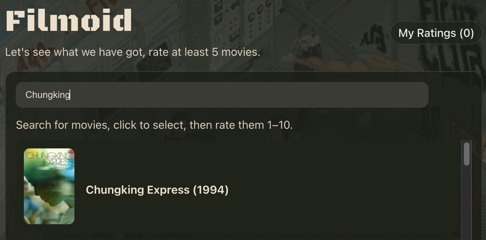
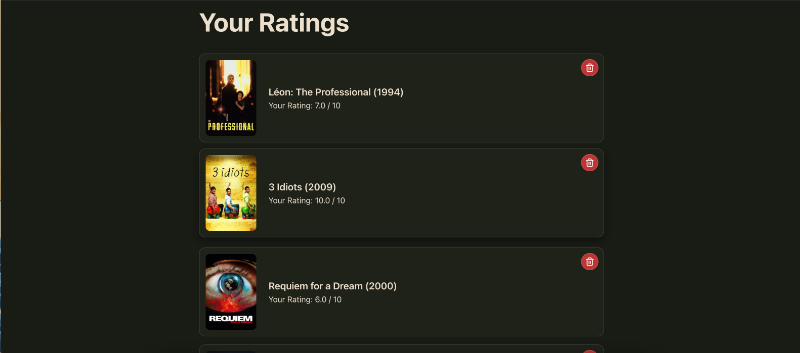
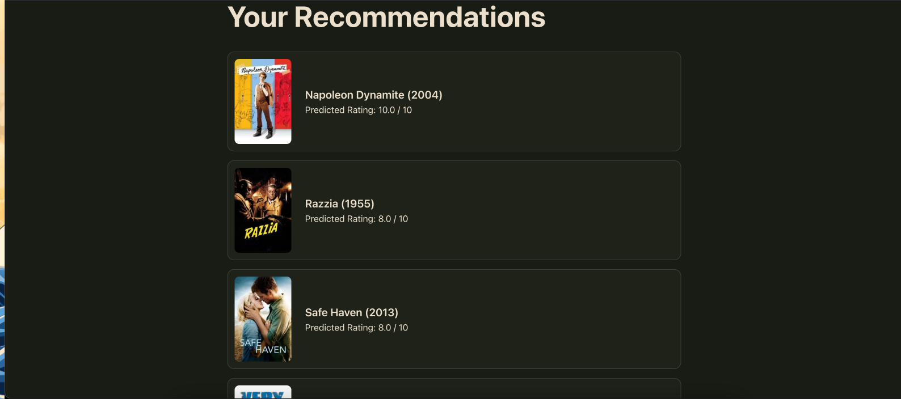
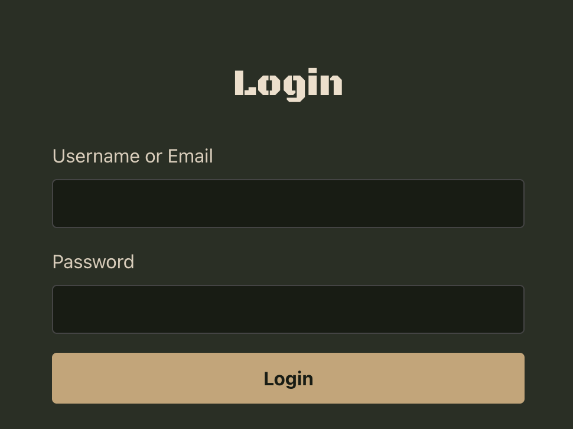

# Filmoid

Filmoid is a full-stack movie recommendation web app developed as part of graduate coursework at **Texas A&M University**.

Users can search for movies via TMDB, rate them on a 1–10 scale, and generate personalized recommendations. Authenticated users get persistent ratings and a history of their past recommendation sessions.

## Live Demo

Frontend:
https://filmoid.vercel.app/


## Features

- 🎬 **Movie search** via TMDB (posters + release years)
- ⭐ **Persistent ratings** for logged-in users (create/update/list/delete)
- 🤖 **Personalized recommendations** generated from user ratings
- 👤 **Authentication** (username/email + password; JWT stored in **HttpOnly cookies**)
- 💾 **Recommendation history** saved as sessions for authenticated users
- ☁️ **Cloud deployment** (Vercel frontend + Hugging Face Spaces backend + Supabase Postgres)

## Current architecture

- **Frontend:** React + Vite (`frontend/`)
- **Backend:** FastAPI + SQLAlchemy (`backend/`)
- **Database:** PostgreSQL (Supabase)
- **Deployment:**
	- Backend deployed on **Hugging Face Spaces** (Docker)
	- Frontend deployed on **Vercel**
	- Vercel rewrite proxies `/api/*` → the HF Spaces backend (see `frontend/vercel.json`)

```mermaid
flowchart LR
	U[User Browser] -->|Vercel| FE[React + Vite Frontend]
	FE -->|/api/* (rewrite)| BE[FastAPI Backend on HF Spaces]
	BE --> DB[(Supabase Postgres)]
	FE -->|TMDB v3 API| TMDB[(TMDB)]
```

## Authentication

- Signup creates a user record in Postgres.
- Login returns a short-lived JWT and sets it as an **HttpOnly cookie**.
- The frontend uses `credentials: 'include'` so cookies are sent to the API.
- Authenticated endpoints use the cookie to identify the current user.

## Recommendation engine

Personalized recommendations are generated using a collaborative filtering model trained with **Surprise SVD** (`backend/models/svd_model.pkl`). At request time, the backend computes recommendations from the user’s provided ratings **without retraining** the global model.

If the SVD model is unavailable (e.g., missing model artifact or missing dependencies), the backend automatically falls back to a **TMDB-based heuristic** recommender so the app continues to work end-to-end.

## Persistent ratings

- Logged-in users can persist ratings through the backend.
- Ratings are stored with a small metadata snapshot (title/poster/release_date) to render quickly without extra TMDB calls.

## Recommendation history

- Every recommendation request is saved as a `RecommendationSession`.
- Authenticated requests are linked to the user; anonymous requests are still saved but not attached to a user.

## Tech stack

**Frontend**
- React 19, React Router
- Vite
- TypeScript

**Backend**
- FastAPI
- SQLAlchemy
- PostgreSQL (via `psycopg2`)
- Auth: `python-jose`, `passlib[bcrypt]`
- Recommender: `scikit-surprise`, `numpy`, `joblib`

## Repository structure

```text
.
├── frontend/                 # React + Vite app (Vercel)
├── backend/                  # FastAPI app + DB models (HF Spaces)
├── Dockerfile                # Backend container for HF Spaces
└── Resources/                # Non-production assets / research artifacts
```

## Local development

### 1) Backend

From the repo root:

```bash
cd backend
python3 -m pip install -r requirements.txt
uvicorn app.main:app --reload --port 8000
```

Backend health check:

- `http://localhost:8000/health`

### 2) Frontend

```bash
cd frontend
npm install
npm run dev
```

The Vite dev server runs at `http://localhost:5173` by default.

## Environment variables

### Frontend (Vite)

Create `frontend/.env` (see `frontend/.env.example`):

- `VITE_TMDB_V3` (required): TMDB v3 API key used for search and for recommendation requests
- `VITE_API_BASE_URL` (optional): defaults to `http://localhost:8000`

### Backend (FastAPI)

The backend loads environment variables via `python-dotenv` (see `backend/.env`).

- `DATABASE_URL` (required): Postgres connection string (Supabase)
- `SECRET_KEY` (required): signing key for JWT cookies
- `ALLOWED_ORIGINS` (optional): comma-separated list of allowed CORS origins
	- default: `http://localhost:5173`
- `FILMOID_RECOMMENDER` (optional): `auto` (default), `svd`, or `tmdb`

## Deployment overview

### Backend (Hugging Face Spaces)

- Built from the repo `Dockerfile`.
- Exposes Uvicorn on port `7860` (HF Spaces convention).
- Requires setting `DATABASE_URL` and `SECRET_KEY` as Space secrets.

### Frontend (Vercel)

- Standard Vite build.
- `frontend/vercel.json` rewrites `/api/*` to your HF Spaces backend URL.
- Set the same `VITE_*` environment variables in Vercel.

## Screenshots

### Home Page


---

### Movie Search



---

### Ratings



---

### Recommendations



---

### Authentication


